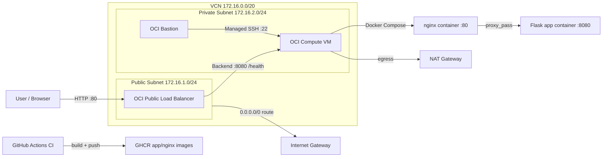

# SysRun Infrastructure and Delivery Deep Dive

This repository provisions and runs a complete OCI-based application stack with Terraform, deploys a containerized app runtime, and automates image publishing through GitHub Actions.

The system is intentionally split into clear layers:
- **Infrastructure as Code (Terraform):** networking, compute, load balancer, and bastion access.
- **Application Runtime (Containers):** Flask app + NGINX reverse proxy.
- **Delivery Automation (CI):** container builds and pushes to GHCR on `main`.

---

## 1) High-Level Architecture

---

## 2) Terraform Layout and Responsibilities

Terraform root for deployment is `terraform/environments/dev`, and it composes three modules:
- `terraform/modules/network`
- `terraform/modules/app`
- `terraform/modules/lb`

### `network` module
Creates core network primitives:
- VCN (`172.16.0.0/20`)
- Internet Gateway for public subnet egress/ingress patterns
- NAT Gateway for private subnet outbound internet access
- Public route table (`0.0.0.0/0 -> IGW`)
- Private route table (`0.0.0.0/0 -> NAT`)
- Public subnet (`172.16.1.0/24`)
- Private subnet (`172.16.2.0/24`, no public IP on VNIC)
- Security lists

Important security behavior:
- Public security list allows inbound HTTP (`TCP/80`) from anywhere.
- Private security list allows:
  - `TCP/8080` from public subnet CIDR only (for LB to app traffic)
  - `TCP/22` from private subnet CIDR (to support managed access path)
- Egress is open (`all`) for outbound updates/pulls.

Tagging model:
- Uses `local.common_tags` (`project`, `environment`, `managed_by`, `owner`) for consistent resource metadata.

### `app` module
Creates one OCI compute instance inside the private subnet:
- Shape defaults: `VM.Standard.A1.Flex`
- CPU/memory defaults: `4 OCPUs`, `24 GB`
- No public IP assigned
- Image selected dynamically from latest Oracle Linux 8 image for the shape
- Cloud-init style startup bootstrap via `setup.sh`

Bootstrap behavior (`setup.sh`):
- System update
- Docker Engine and compose plugin install
- Docker service enabled
- `opc` added to docker group
- Clones your app repo and runs `docker compose up -d`

### `lb` module
Creates external entrypoint and access tooling:
- OCI flexible public load balancer (`100-1000 Mbps`)
- Backend set using HTTP health checker on `/health` port `8080`
- Backend target = app VM private IP (`:8080`)
- HTTP listener on port `80`
- OCI Bastion and managed SSH session targeting the app instance (`opc`, port 22)

---

## 3) Environment Wiring (`terraform/environments/dev`)

This environment is orchestrator glue:
- Calls all modules
- Passes compartment, region, keys, and subnet outputs between modules

Flow of data:
1. `network` outputs subnet IDs.
2. `app` consumes private subnet ID and outputs `instance_id` + `private_ip`.
3. `lb` consumes app outputs and network outputs.

Credential and input model:
- Provider is configured explicitly with OCI identity variables.
- `terraform.tfvars` is expected locally for real values.
- `terraform.tfvars.example` is provided as a non-secret template.

---

## 4) Container Runtime Design

`docker-compose.yml` defines two services:

### `app` service
- Built from `app/Dockerfile`
- Flask server listens on `0.0.0.0:8080`
- Health endpoint: `/health`
- Compose healthcheck probes local app health

### `nginx` service
- Built from `nginx/Dockerfile`
- Publishes `80:80`
- Reverse proxies `/` to `app:8080`
- Own health endpoint: `/healthz`
- Depends on healthy app service before startup

Traffic inside the VM:
1. Inbound HTTP hits NGINX.
2. NGINX forwards to Flask app container.
3. Flask serves `index.html` and health status JSON.

---

## 5) CI/CD Behavior (`.github/workflows/ci.yml`)

Current workflow executes on push to `main`:
- Logs in to GHCR with `GITHUB_TOKEN`
- Builds `app` image and pushes:
  - Immutable tag: `${GITHUB_SHA}`
  - Mutable environment tag: `prod`
- Builds `nginx` image and pushes same tag strategy

Why dual tags are useful:
- SHA tag gives reproducible rollback/reference.
- `prod` tag gives stable deploy pointer for runtime consumers.

---

## 6) Security Model and Trust Boundaries

### External exposure
- Intended public ingress is HTTP on load balancer (`TCP/80`).
- App compute instance stays in private subnet with no public IP.

### Internal segmentation
- App port `8080` is not globally open; only LB subnet CIDR is allowed.
- Administrative SSH is designed through OCI Bastion managed sessions.

### Secrets handling
- Sensitive `.tfvars` should remain untracked.
- Keep provider credentials in local files and/or environment, not committed files.
- `terraform.tfvars.example` should contain placeholders only.

---

## 7) Operational Lifecycle

### Initial provisioning
1. Fill local `terraform/environments/dev/terraform.tfvars`.
2. `terraform init`
3. `terraform plan`
4. `terraform apply`

### App bootstrap on instance
- Instance startup script installs Docker and starts compose stack.
- Health checks at both app and proxy layers support LB and local readiness behavior.

### Ongoing delivery
- Push to `main` triggers CI image publishing to GHCR.
- Infrastructure and runtime can evolve independently:
  - Terraform changes for topology/security/capacity
  - App/NGINX changes for application behavior

---

## 8) Files to Know First

- `terraform/environments/dev/main.tf`: module composition
- `terraform/environments/dev/providers.tf`: OCI provider setup
- `terraform/modules/network/main.tf`: VCN/subnets/routes/security lists
- `terraform/modules/app/main.tf`: compute instance declaration
- `terraform/modules/app/setup.sh`: bootstrap and compose startup
- `terraform/modules/lb/main.tf`: public LB + bastion
- `docker-compose.yml`: runtime service topology
- `nginx/nginx.conf`: reverse proxy behavior
- `app/test.py`: Flask app and health endpoint
- `.github/workflows/ci.yml`: image build/push automation

---

## 9) Current Limitations and Next Improvements

If you want production hardening next, the highest-impact upgrades are:
- TLS termination on LB (HTTPS listener + cert management)
- Replace boot-time `git clone` with pinned image deployment strategy
- Add CI validation stages (`terraform fmt/validate`, app tests, compose checks)
- Narrow security-list egress and SSH scope further
- Add observability (structured logs + metrics + alerts)

